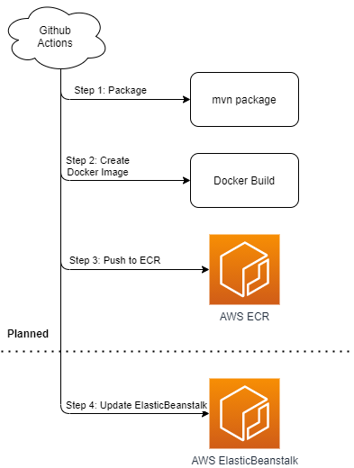
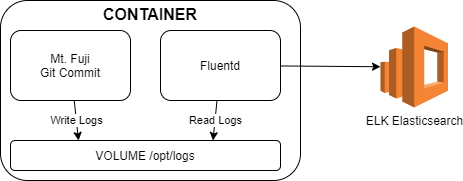
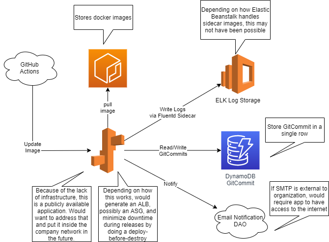

# Mt Fuji Git Commit Application

[APPLICATION REQUIREMENTS](docs/REQUIREMENTS.md)

## Run Instructions
mvn spring-boot:run -Dspring-boot.run.profiles={SOMEPROFILEHERE}

<b>Allowed Profiles:</b>
- `default` -- Will only log to STDOUT
- `win-local` -- Will log to C:/logs/git-commit/app.log
- `docker` -- Will log to /opt/logs/app.log

## Endpoints 
- `/swagger-ui.html` - A UI that documents how the API works and the allowed endpoints.
- `POST /gitCommit` - Will take a GitCommit object and save it to the backend datastore. Will return a list of Jira IDs
  - <b>NOTE:</b> SHA1 must be valid, or the GitCommit will not be accepted.
- `GET /gitCommit` - Will allow a user to do some basic searches on the stored data.

## Configurations
### Backend Type
This application is set up to be flexible on how the data is stored. If future requirements dictate, we may need to make
a more complicated backend, thus we have a simple interface that gives the deployment a way to store data in multiple ways.
- `backendType` -- Currently, `dynamodb` and `simple` are the only 2 available options. `simple` is a HashMap-based local
storage method and is not robust enough for production use. However, it works good for testing locally, or in development environments.

<b>NOTE: due to deployment issues, DynamoDB infrastructure was not created, but was planned</b>

### Dynamo DB
<b>NOTE: due to deployment issues, this infrastructure was not created, but was planned</b>

This is a backend datastore for Git Commit. This simple table structure will store the records in a single row.
- `dynamodb.url` -- the URL that the application will reach out to
- `dynamobd.region` -- the AWS region the DynamoDB table exists. Currently only `us-east-1` is valid

### Jira
This will let the user create a list of Jira ticket Ids that will be parsed out of the `message` variable of a `GitCommit` object
- `jira` -- A comma delimited list of the jira ticket identifier.

### Notify Configuration
A requirement was that the IT team needed to be notified of changes, an interface has been created that will allow notifications
to be easily created and added to. Currently logging and email notifications exist, but it could easily be expanded. See `NotifyDaoConfig.java`
- `notify.email.enabled` -- If `true`, then it will enable this notification type.
- `notify.email.fromAddress` -- Who the email will be coming from. Please validate that this is a validly formed email address
- `notify.email.addresses` -- Comma separated list of email addresses. Please validate each email address is validly formed.
- `notify.logs.enabled` -- A simple logger that will create a notification in the logs. Used for debugging and troubleshooting.
- `mail.host` -- SMTP provider
- `mail.port` -- Default port for SMTP is `587`, though a port must be set for this to work.
- `username` -- Username/Email of the SMTP provider
- `password` -- Username/Email password
- `mail.smtp.auth` -- values can be `true` or `false` depending on provider
- `mail.smtp.starttls-enable` -- values can be `true` or `false` depending on provider

<b>NOTE:</b> Mail has only been tested with Gmail SMTP -- Accounts must have the feature <b>Less Secure Apps</b> to be allowed (default, they are blocked).

## Application Stack
- <b>Java 8</b> -- Language of choice
- <b>Spring Boot 2</b> -- Used to simplify deployments, ease testing with Dependency Injection, and has lots of prebuilt features accessible via annotations to speed development.
- <b>Lombok</b> -- Library that simplifies boiler-plate Java code. <b>NOTE:</b> Most IDEs require a plugin to keep their Intellisense from throwing errors.
- <b>Logback</b> -- Logging library that plays well with Spring. (See logback-spring.xml for configurations)
- <b>Maven</b> -- Simplify package management in Java
- <b>JUnit 4</b> -- A testing framework for writing unit tests
- <b>Mockito</b> -- Great mocking framework for unit testing

## Deployment Stack
- <b>Github</b> -- A Git repository where the application source code is stored and managed.
- <b>Github Actions</b> -- A CI/CD pipeline (see .github/ folder for configurations)
- <b>Docker</b> -- A Dockerfile will create an environment for the application to run in a reliable way
- <b>AWS Elastic Container Registry</b> -- A place to save Docker images for reference within the AWS infrastructure.
- <b>AWS Elastic Beanstalk</b> -- A way to run web services quickly and easily within AWS.

## Deployment Overview
<b>NOTE:</b> Because of technical issues, we were unable to deploy to ElasticBeanstalk since it had IAM access
issues when trying to pull a container from ECR.

## Proposed Container Overview
Because of the technical issues involving access, I was unable to create a sidecar application for logging.
However, this is the proposed solution that I would have created.

## Proposed AWS Infrastructure Overview
Because of the technical issues involving access, I was unable to build most of this infrastructure.

